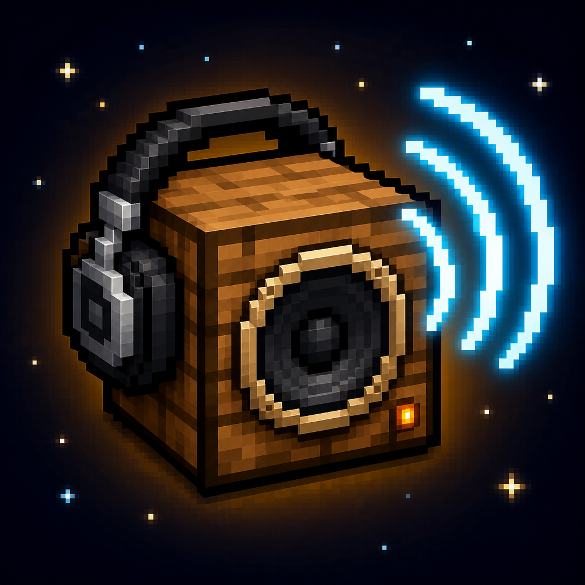
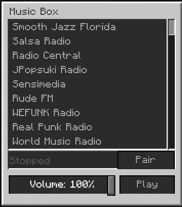
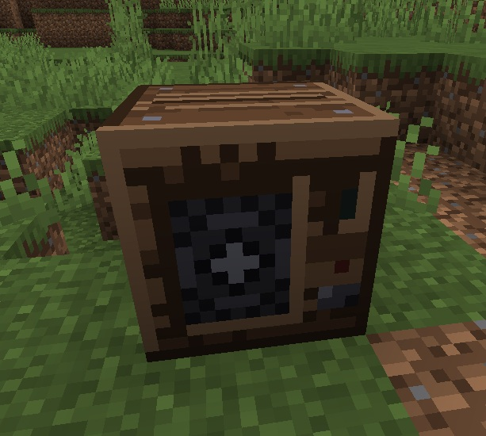
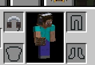

<br />
# MusicBox Radio

A Minecraft 1.19.2 mod that adds a **Music Box** block which streams internet radio stations,
**Speakers** that relay it around a build, and **Headphones** that let you keep listening
anywhere in the world.

The mod id is `musicboxradio`. There are several unrelated mods called "Music Box", so the
registry namespace, config folder and jar are all named `musicboxradio` to stay out of their way.

| | | |
| --- | --- | --- |
|  |  |  |

Ports live under `ports/`, each a standalone Gradle project:

| Port | Loader | Build |
| --- | --- | --- |
| `ports/1.19.2` | Forge 43.5.2 | `cd ports/1.19.2 && ./gradlew build` |
| `ports/1.19.2-fabric` | Fabric Loader 0.16.14, Fabric API 0.76.1 | `cd ports/1.19.2-fabric && ./gradlew build` |

> NeoForge has no 1.19.2 build - it forked from Forge at 1.20.1 - so there is no NeoForge
> port at this version.

Both ports need **JDK 17**. Each `gradle.properties` pins `org.gradle.java.home` to a local
JDK 17 path; change it to yours, or delete the line if your `JAVA_HOME` is already 17.

## How it works in game

Place a music box and right-click it to open the station list. Pick a station and it starts
playing immediately for everyone nearby. The record on the front spins while it plays and both
sides show a spectrum display driven by the audio, and the block emits a comparator signal of
15 so you can wire redstone off it.

**Proximity is the default.** Nearby players hear the box positioned in the world, panned and
faded with distance out to `proximityRange` blocks.

**Headphones override that.** Craft headphones, wear them in the helmet slot (or a Curios /
Trinkets slot if you have those installed), and one box is piped straight to your ears in full
stereo at any distance - across dimensions included. Unpaired headphones just follow whichever
box is playing nearest to you.

### Pairing headphones to a box

Pair as many headphones as you like to the same box and everyone wearing them hears the same
station, changing together the instant anyone changes it. Three ways to pair, all equivalent:

- Press **Pair** in the box's GUI. Pairs whatever headphones you are wearing or holding.
- Sneak-right-click the box with empty hands while wearing headphones.
- Sneak-right-click the box holding headphones.

Repeating the gesture on the box you are already paired to unpairs you. A paired box that is
switched off means silence rather than falling back to the nearest box - you asked for that
box specifically.

Pairing is stored on the headphone item, so it survives being taken off, traded or put in a
chest, and each pair of headphones can be pointed at a different box.

### Speakers

Speakers relay a music box to somewhere else in the world. They are proximity sources at their
own position, so a few of them will carry a station across a base without the box needing to be
in the room, and the cone visibly moves with the bass.

- **Pair before placing.** Sneak-right-click a music box holding a speaker to link the stack,
  then place them. Repeating the gesture on the same box unlinks it.
- **Re-point one already placed.** Right-click it for a list of every music box within 24
  blocks, plus its own volume slider and an unpair button.

A speaker follows whatever its box is playing, including station changes, and goes quiet when
the box is stopped. The link survives the box being far away, in an unloaded chunk, or in
another dimension, because the server resolves it and copies the answer onto the speaker
rather than making listeners look the box up.

### Server authority

The server owns everything that matters: which station is selected, the volume, and whether
the box is playing all live on the block entity and are only ever changed server-side. Station
picks arrive as an index that the server re-resolves against its own `stations.json`, so a
modified client cannot make a box play an arbitrary URL - it can only pick from the list the
operator configured.

Paired headphones can outrun render distance, so the server pushes the paired box's state
straight to each listener on the mod's own channel instead of relying on the block entity being
loaded client-side. If the box's chunk unloads server-side, listeners coast on the last known
state, which is by definition still correct - an unloaded box cannot change.

Clients each open their own connection to the station, so "in sync" means everyone is at the
same point in a live broadcast, within normal buffering jitter of a second or two. Audio is
never relayed through the server.

### Audio quality

OpenAL only spatialises **mono** sources, which is what buys positional panning and distance
falloff, so a stereo station played in the world gets two mono voices carrying a channel each,
placed a little over a block apart either side of the block. Distance and placement work as
normal and the stereo image survives; summing the channels to one voice used to cancel out
anything panned wide, which is what made synth-heavy stations sound thin.

Headphone playback is genuine unmodified stereo at the station's native sample rate (44.1 kHz
for every shipped default), head-locked and unattenuated.

One station is decoded once no matter how many blocks are playing it. A box and its speakers
are emitters on a single shared stream, which is both what keeps them sample-aligned with each
other - two independent connections would arrive at different points in the broadcast and comb
filter - and what holds the mod to one connection per station, since plenty of stations cap
connections per address.

## Configuring stations

`config/musicboxradio/stations.json`, written on first launch. The station block is a plain
label-to-URL mapping and entries appear in the GUI in the order you write them:

```json
{
  "proximityRange": 24.0,
  "maxConcurrentStreams": 3,
  "stations": {
    "Rust Radio": "http://your-stream-here/;",
    "SomaFM Groove Salad": "https://ice1.somafm.com/groovesalad-128-mp3"
  }
}
```

- Direct MP3 streams work best. `.m3u`, `.m3u8` and `.pls` playlist URLs are followed
  automatically, as are HTTP redirects.
- Shoutcast servers that answer `ICY 200 OK` are handled, and `StreamTitle` metadata is shown
  as the now-playing line in the GUI.
- Up to 100 stations. The list is server-authoritative: clients receive it when they open a
  box, and the server resolves station picks against its own copy, so a modified client cannot
  make a box play an arbitrary URL.
- `maxConcurrentStreams` caps how many boxes one client will decode at once. Headphone
  playback always gets a slot.

### Client settings

`config/musicboxradio/client.json`:

```json
{
  "streamingEnabled": true,
  "masterVolume": 1.0
}
```

Set `streamingEnabled` to `false` to mute all internet radio on your client - the equivalent
of Rust's "Internet Audio Streams: Off", useful while recording or streaming. In-game the
**Jukebox/Records** volume slider also applies.

### Shipped defaults

Twenty-four stations, all verified to connect and decode:

- The nine RUST boombox stations whose stream URLs are publicly documented. The rest are not
  published anywhere public; paste them in from your server's `BoomBox.ServerUrlList` if you
  have them.
- Magic Oldies Florida, Vaporwave Radio (Nightwave Plaza) and KX105 Kawartha Lakes.
- Twelve SomaFM channels as known-good examples.

## Security note

Same caveat Facepunch gives for Rust: the game connects directly to whatever URL you list, so
the station host can see connecting players' IP addresses. Only add stations you trust.

## Recipes

- **Music Box** - a ring of any planks around a note block, with redstone below it.
- **Speaker** - a note block and an iron ingot stacked inside a surround of any wool.
- **Headphones** - an iron ingot on top, leather either side, wool ear cups.

## Implementation notes

Minecraft's sound engine only decodes local OGG Vorbis files, so the mod runs its own audio
path:

- `HttpAudioStream` speaks HTTP over a raw socket. The JDK's `HttpURLConnection` cannot be
  used because it rejects Shoutcast's `ICY 200 OK` status line.
- `IcyMetadataStream` de-interleaves `StreamTitle` metadata from the audio bytes.
- `StreamDecoder` decodes MP3 to PCM with JLayer on a background thread. JLayer is pure Java
  with no transitive dependencies and is bundled into the jar.
- `AlStreamSource` queues that PCM onto OpenAL sources inside Minecraft's existing AL context,
  on the render thread. It owns a set of emitters - the box and any speakers relaying it -
  which are handed identical chunks and started deliberately, so they stay together. Distance
  falloff is computed in Java with the AL rolloff factor set to zero, so the curve does not
  depend on whichever distance model Minecraft has set globally.
- `Spectrum` runs a 1024-point FFT over each analysis window and folds the bins into five
  roughly logarithmic bands. `SpectrumFeed` is the part that matters: it holds those bands in a
  queue advanced by OpenAL's count of finished buffers, so the renderers are always asked about
  the buffer currently playing rather than the ones queued behind it. Analysing at queue time
  and drawing immediately would put the meter most of a second ahead of the music.

Every GUI interaction - station, volume, stop, pair - rides on vanilla's container-button
packet, so nothing the player clicks needs a custom packet. The mod's one channel is
server-to-client only: `HeadphoneSync` diffs each wearer's paired box four times a second and
pushes a `PairedBoxPayload` when it changes, which is what lets headphones keep playing past
render distance without the client inventing state.

## Tools

- `tools/generate_textures.py` regenerates every sprite as pixel art. No dependencies; run it
  from the repo root.
- `tools/streamcheck/StreamCheck.java` exercises the real HTTP and MP3 path against a list of
  `Label=url` arguments outside Minecraft, to catch dead stations.
